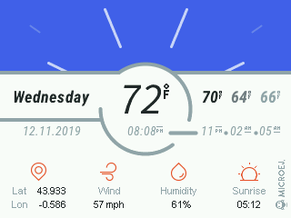

# Overview

This application demonstrates a weather station's user interface with audio and GNSS support. 

Then entry point (`main`) can be found at `com.microej.spresense.demo.SpresenseDemo`

# Usage

This demo requires a Sony Spresense platform to have been built.
We tested the project against this [platform](https://github.com/MicroEJ/Platform-Sony-Spresense), to build it , please follow the README at the root of the repository.

## Run on MicroEJ Simulator

1. Right-click on the project
2. Select **Run as -> MicroEJ Application**
3. Select **[Sim] SpresenseDemo**
4. Press **Ok**

## Run on a device

### Build

1. Right-click on the project
2. Select **Run as -> Run Configuration**
3. Select **[Emb] SpresenseDemo**
4. Press **Ok**
5. The application file (`.o`) has been generated

### Flash

1. Compile, link and flash the board following the platform's README.

### Memory configuration

The application comes with a MicroEJ launch configuration (**[Emb] SpresenseDemo**). This configuration is compatible with the default memory layout provided in the platform.

The important configuration are, in the **Configuration** tab of the launch configuration:
1. **Runtime -> Memory -> Java heap** : Set to **50 000**
2. **Runtime -> Memory -> Immortal heap** : Set to **1024**
3. **Runtime -> Thread -> Number of threads** : Set to **7**
4. **Libraries -> MicroUI -> Image Heap** : Set to **2000**

# Requirements

This example has been tested on:

* MicroEJ SDK 5.1
* With a Sony Spresense platform that contains:
    * EDC-1.2
    * BON-1.3
    * SNI-1.3
    * MICRO UI-2.3
    * AUDIO-0.9
    * GNSS-0.9

# Dependencies

_All dependencies are retrieved transitively by Ivy resolver_.

# Source

N/A

# Restrictions

None.

---
_Copyright 2019 Sony Corp. All rights reserved._  
_This Software has been designed by MicroEJ Corp and all rights have been transferred to Sony Corp._  
_Sony Corp. has granted MicroEJ the right to sub-licensed this Software under the enclosed license terms._  
